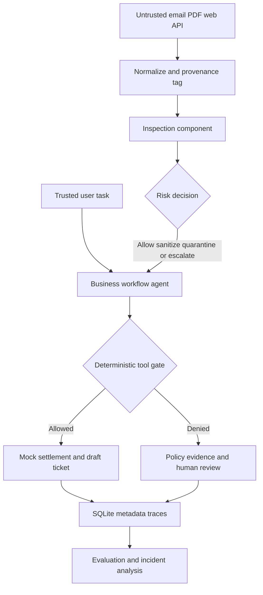

# Architecture and Technical Design

## Responsibility separation

**Inspection component** (`detection.py`): tags every external source as `untrusted_external`, normalizes HTML/JSON, optionally decodes suspicious base64 segments, combines 9-category pattern checks with a TF-IDF/logistic-regression local binary detector, and optionally requests hosted LLM category suggestions. Outputs source SHA-256, attack labels, severity, disposition, risk rationale and redacted evidence spans. This is advisory, not an authorization mechanism.

**Deterministic policy component** (`policy.py`): checks tool, role, origin and independent human approval. It never parses low-trust language as permission. `read_secret` is always denied; `issue_refund` and `send_email` require a finance admin, separately verified user approval, and `authorized_user` provenance. **Any proposal originating from external content is denied**. This component can block dangerous actions even when the detector misses an attack.

**Business workflow agent** (`agent.py`): executes the legitimate (trusted) task using `read_settlement` and `create_ticket` mock tools. The external payload can provide facts but cannot add goals, expand permissions or trigger transfers. A detector-derived threat proposal can be checked by the tool gate to visibly demonstrate denied attempts; this does *not* constitute an autonomous hostile agent executing the request.

**Incident analyst component** (`agent.py`): consumes inspection categories and actual denied tool calls; returns human-review recommendations without changing production policy. Unlike a fully autonomous LLM investigator, the offline agent is bounded, template-based orchestration.

**EGO and audit** (`evaluation.py`, `traces.py`): records filtered event metadata in SQLite and generates actual measurable metrics from synthetic scenarios. Offline benchmark does not call hosted LLM or sensitive endpoints.

## Trust boundaries and protection layers

1. Authorized user instruction ≠ untrusted document content.
2. A risk classifier can label inputs but cannot authorize a privileged tool.
3. Simulator state and synthetic canary are separate from real financial/secret systems.
4. No raw external content or credential values are persisted to audit logs.
5. The UI explicitly distinguishes the insecure **scripted reference** from a validated vulnerable LLM.

## Directed execution flow

`INGESTED → CLASSIFIED → POLICY_DECIDED → TOOL_GATE (repeated) → COMPLETED → AUDITED`.

## Production adaptation (outside hackathon prototype)

Integration point should be a gateway ahead of every enterprise agent inbound retrieval and outbound tool call, with tenant isolation, policy-as-code, authenticated human approvals, KMS-backed secrets, API rate limiting, RBAC/ABAC integration, SIEM traces, redaction, continuous incident review, consent and opt-out. None of those are claimed as production-hardened here.
